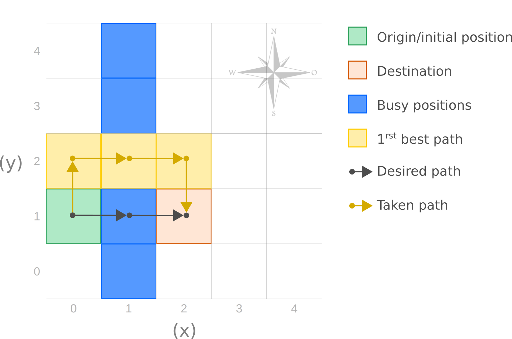

# Kenzie Rover Space Probe Control System

Kenzie Rover is an application of a Space Probe Control System.

This application is responsible for reading instructions in lines through standard input (_stdin_); interpret such instructions; and return a respective answer to each input line. The input instructions represent coordinates and commands for controlling space probes.

# Resources

The application was written in _Javascript/Typescript_ language, and is based on _Node.Js_.

[**Node.js**](https://nodejs.org/) is a _runtime_ environment for Javascript(JS), _open-source_ and cross-platform, used to run JS code outside of a web browser. It is an environment used to build scalable web applications, employing a non-blocking, event-oriented I/O model, making it fast and light in resources.

Whereas, [**TypeScript(TS)**](https://www.typescriptlang.org/), in short, is a strict syntactic _superset_ for JavaScript, allowing the code to declare static typing since JS does not have this property. The use of TS facilitates the identification of possible failures, even at compile time, in addition to making the code more concise, reliable and readable.

In addition to Node.js and TS as the main base features of this project, [**Jest**](https://jestjs.io/), a testing framework maintained by Facebook, was also added.

Furthermore, no other library or framework resources were used. Therefore, the imports made in the codes are either author-implemented codes or native functionality of Node.js and JS itself.

# Decisions

Overall, the focus remained on a simple and functional application. Although the context presented is a technical challenge, the objective was to develop an application adaptable to other technologies and capable of meeting a real demand for use, therefore, we sought to maintain the **decoupling** between the logical entities, keeping the higher-level layers (**Domain/Business**) and lower-level layers (**Infrastructure**), making them more independent from each other, through the principle of **Dependency Inversion (DI)**.

# Assumptions

## [Greedy Algorithm](https://en.wikipedia.org/wiki/Greedy_algorithm)



# Run

There are two way to running this application:

- Locally;
- Through Docker.

## Running Locally

### Prerequisites

- [npm (Node Package Manager)](https://docs.npmjs.com/downloading-and-installing-node-js-and-npm)
- [node >= 14.18.1](https://nodejs.org/)
- [tsc (TypeScript Compiler)](https://www.typescriptlang.org/download)

To run the application locally follow the steps below:

### 1. Install Dependencies

```bash
npm install
```

### 2. Build

```bash
npm run build
```

### 3. Run

```bash
node build/app < your-file
```
#### Application Available Flags

`-f`: Indicates File. It must be followed by a file path.
`--it`: Indicates iterative mode. It means for each input needed it'll log the input format expected. 

### Command Summary

```bash
npm install
npm run build
node build/app < your-file
```

> If prefer it's possible to omit input-file and interact directly to the app's default input.
\
> run: node build/app   

## Running Through Docker

### Prerequisites

- [Docker](https://docs.docker.com/engine/install/)
- [Docker Compose](https://docs.docker.com/compose/install/)

The execution through Docker can be done in two ways: 

- Directly (without interact with container)
- Through Container 

### Directly (without interact with container)

Direct execution, via docker, occurs through the `app.sh` script that pipes the input file to the Kenzie Rover application within Docker container.

To do so, perform the following steps:

1. Give the file execute permission `app.sh`

```bash
chmod +x app.sh
```
2. Build Dockerfile

```bash
npm run docker:build
```
3. Run

```bash
./app.sh < you-file
```

#### Command Summary

```bash
chmod +x app.sh
npm run docker:build
./app.sh < you-file
```

### Through Container 

When running via Docker container, it's necessary to access the container and run the application:

1. Add Files To Mounted Volume (_optional_)

Create a _resources_ folder in the local directory (root path), and add your files inside this folder.

2. Build Docker-compose

```bash
docker-compose up
```

2. Access Container

On another terminal run:

```bash
docker exec -it cont-kz-rover sh
```

3. Run

At any time add new files to the _resources_ folder, if desired, and they will immediately sync with the _resources_ folder in the container. Thus, after accessing the container, execute the following command to run the application:

```bash
node build/app < ./resources/your-file

# Or
# node build/app
```

#### Command Summary

```bash
docker-compose up
docker exec -it cont-kz-rover sh
node build/app < ./resources/your-file
```